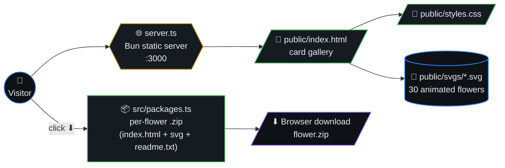
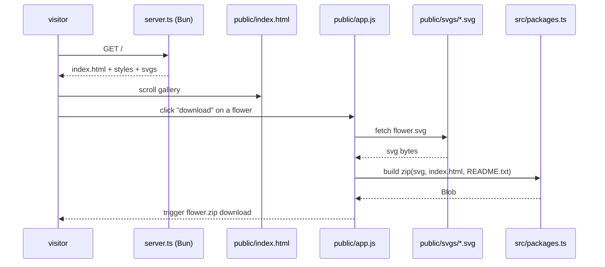
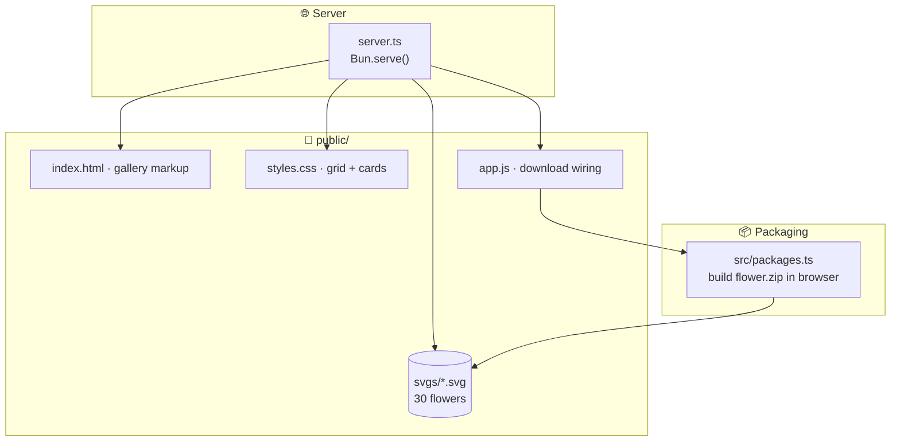
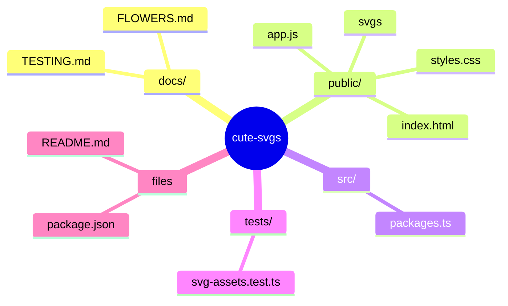

# Cute SVGs

A small public-ready collection of animated flower SVG cards served by Bun.

Each flower card includes a package download. The zip contains `index.html`,
`flower.svg`, and `README.txt`, so recipients can unzip it and open the HTML
file directly in a browser.



## Table of contents

- [Included flowers](#included-flowers)
- [Run locally](#run-locally)
- [Architecture at a glance](#architecture-at-a-glance)
- [Download flow (sequence)](#download-flow-sequence)
- [Project structure](#project-structure)
- [Known status](#known-status)
- [🗺️ Repository map](#️-repository-map)

## Download flow (sequence)



## Included Flowers

- Cherry Blossom Pop
- Hibiscus Bloom
- Daisy Dance
- Sunflower Smile
- Rose Bloom
- Rose Vine Twirl
- Hydrangea Cluster
- Lavender Sprig
- Peony Puff
- Poppy Pop
- Wisteria Droop
- Lily Belle
- Tulip Breeze
- Monstera Glow
- Rainbow Zinnia
- Bluebell Chime
- Golden Marigold
- Coral Orchid
- Cosmos Confetti
- Iris Shimmer
- Forget-Me-Not Stars
- Cactus Bloom
- Anemone Burst
- Buttercup Spark
- Camellia Spiral
- Dahlia Dream
- Lotus Lantern
- Magnolia Moon
- Morning Glory
- Snapdragon Parade

See [docs/FLOWERS.md](docs/FLOWERS.md) for the full design system reference and component vocabulary.

## Run Locally

Prerequisite: Bun installed.

```bash
bun run start
```

Then open:

- http://localhost:3000

Cute SVGs uses this single fixed local port. If `3000` is already busy, stop the existing Cute SVGs server before starting another one.

For auto-reload while editing:

```bash
bun run dev
```

## Architecture at a glance



## Project Structure

- `server.ts`: tiny static file server
- `public/index.html`: card gallery markup
- `public/styles.css`: page/card styling
- `public/svgs/*.svg`: animated flower assets
- `src/packages.ts`: browser-openable flower zip package generation

## Known Status

- Sunflower Smile and Hibiscus Bloom are considered good/stable.
- Cherry Blossom Pop was updated to better match the 🌸 emoji shape.
- Daisy Dance now points to the dedicated daisy asset.
- The gallery now includes 30 animated SVG cards with broader color variety.

Last remaining visual polish:

- Minor micro-alignment tweaks may still be done after visual QA.


## 🗺️ Repository map

Top-level layout of `cute-svgs` rendered as a Mermaid mindmap (auto-generated from the on-disk tree).


